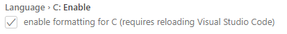
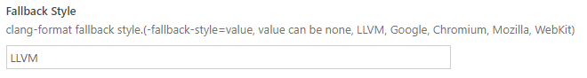

# clang-format扩展使用方法

## 1. 在vscode扩展界面搜索`clang-foramt`，并安装

## 2. 在配置界面根据需要自动排版的编码语言（此处以C为例）


## 3. 配置clang-format程序路径
在vscode settings.json中增加如下项目，并将xxx替换为`clang_format.exe`路径，通常保存在vscode安装路径下的`extensions`文件夹中。以下为样例：
```
"clang-format.executable": "C:\\Users\\lynnjin\\.vscode\\extensions\\ms-vscode.cpptools-0.27.0\\LLVM\\bin\\clang-format",
```

## 4. 引用默认clang-format模板
clang-format默认支持几种典型的代码格式化模板：`LLVM`、`Google`、`Chromium`、`Mozilla`、`WebKit`。

如果要直接引用如下典型配置，可以按照下图配置（以`LLVM`为例）：


## 5. 默认模板不满足要求时，需要个性化定制格式化模板
在`clang-format.exe`路径中使用如下命令行导出典型模板：
```
clang-format -style=llvm -dump-config > .clang-format       //导出LLVM风格模板
clang-format -style=Google -dump-config > .clang-format     //导出Google风格模板
clang-format -style=Chromium -dump-config > .clang-format   //导出Chromium风格模板
clang-format -style=Mozilla -dump-config > .clang-format    //导出Mozilla风格模板
clang-format -style=WebKit -dump-config > .clang-format     //导出WebKit风格模板
```
导出的文件将会保存在`clang-format.exe`路径，将导出的.clang-format文件拷贝到代码路径后按照自定义需要修改即可生效。

**使用命令行生成的`.clang-format`文件可能不是UTF-8格式，非UTF-8格式的文件不会生效，可以使用`notepad++`等文本编辑器调整文件编码类型**
