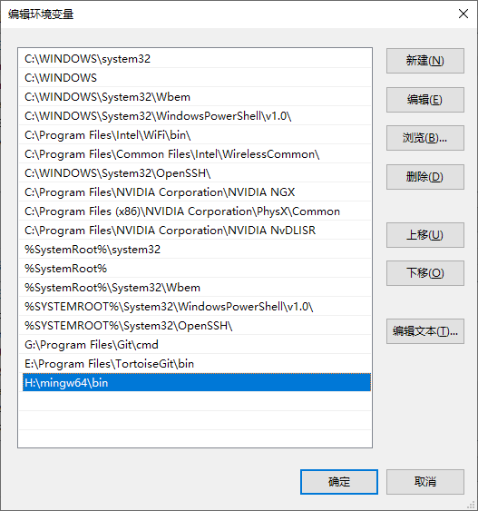
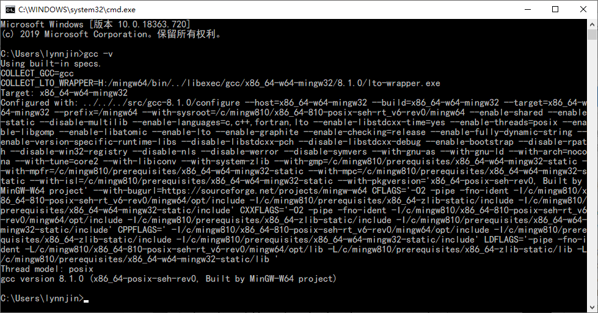

# vscode编译C代码

## 1. 准备

### 1.1 编译器（MinGW-w64 - for 32 and 64 bit Windows）

#### windows安装说明：

在windows全局变量的`PATH`中增加`\mingw64\bin`路径



可以在windows cmd或者power_shell中输入`gcc -v`确认是否成功安装编译器



### [下载链接](https://link.zhihu.com/?target=https%3A//sourceforge.net/projects/mingw-w64/files/)

### 2.1 vscode插件安装

#### C/C++


#### code runner


### 2.2 调整编译配置文件
在代码路径中新增`.vscode`文件夹，并在文件夹中新建三个文件：[`launch.json`](extension/code_runner/launch.json)、[`settings.json`](extension/code_runner/settings.json)、[`tasks.json`](extension/code_runner/tasks.json)

## 2. 编译
在编写好的.c文件中通过快捷键`F5`进行编译和运行。

**尤其需要注意的时在vscode的配置文件`settings.json`中调整如下配置，指定为windows command路径或者power_shell路径。**

```
"terminal.integrated.shell.windows": "C:\\Windows\\System32\\WindowsPowerShell\\v1.0\\powershell.exe",
```